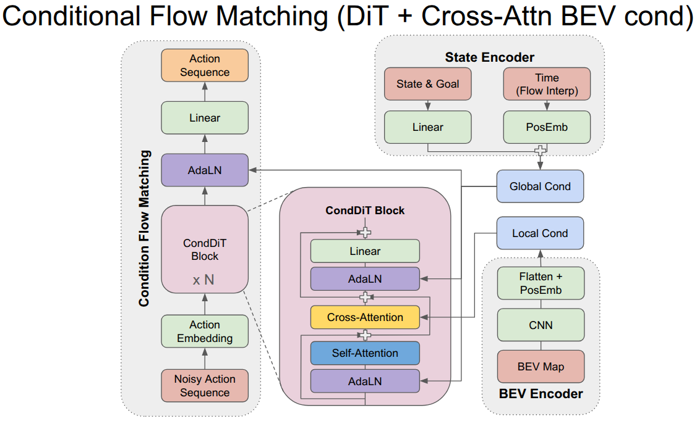
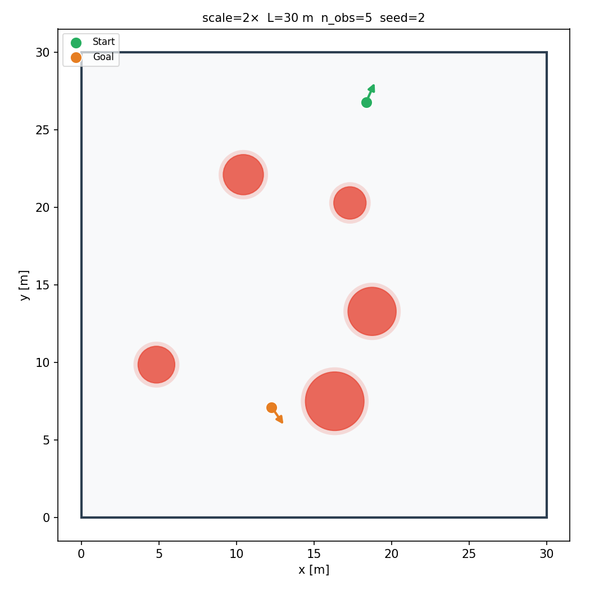
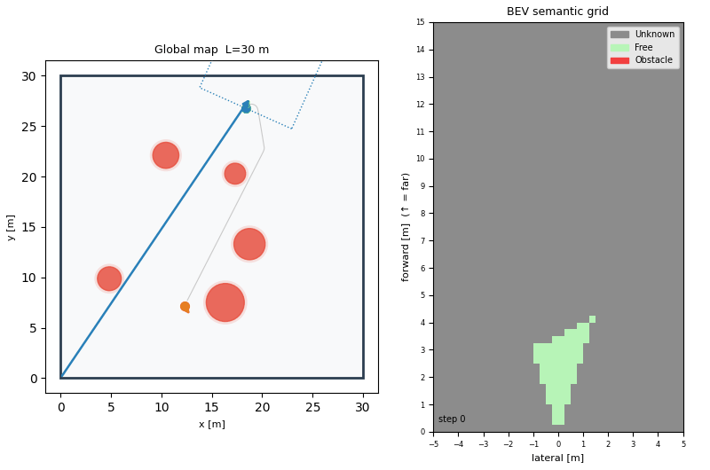

# ASV BEV Flow Policy

This repo contains a compact pipeline for learning navigation policies for an ASV
using BEV semantic grids and flow-matching models. It covers synthetic map
generation, demonstration collection, training, and evaluation with rollouts.



## Quickstart (end-to-end)

### 1) Generate maps

```bash
python -m scripts.data.gen_maps
```

This creates map folders under `outputs/maps/` (each contains `map.json`, `map.png`).

### 2) Generate demos (per map)

```bash
python -m scripts.data.gen_maps --gen_demos --n_demos 200
```

This adds `demos.npz` and `demos_preview.png` under each map folder.

### 3) Train policy

```bash
python -m scripts.train.train_cond_flow_policy
```

Checkpoints are saved under `outputs/runs/<run_name>/`.

### 4) Evaluate policy

```bash
python -m scripts.eval.eval_cond_policy --ckpt outputs/runs/<run_name>/best_model.pt
```

Rollouts and summaries are saved under `outputs/eval/`.

## Visualizations (from `outputs/maps/`)

- Map preview:

  
- Demo preview (GIF):

  </img>

If your workspace uses different map ids, replace the path with another folder
under `outputs/maps/`.
